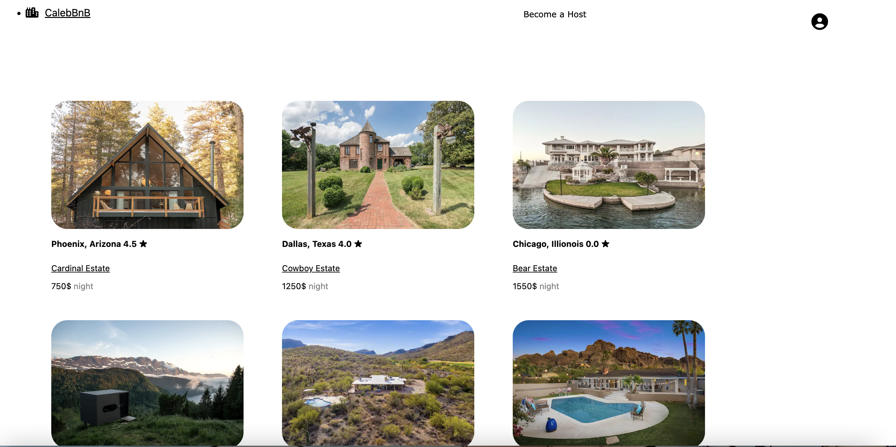
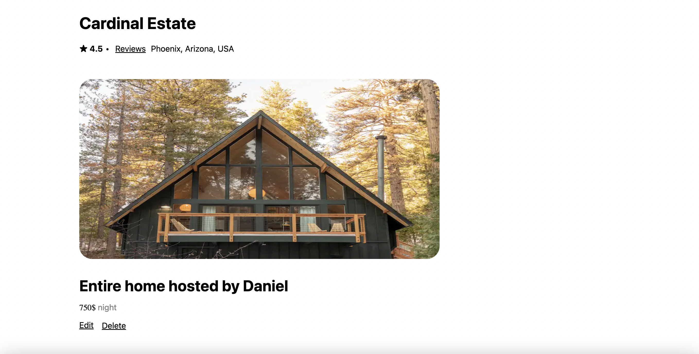
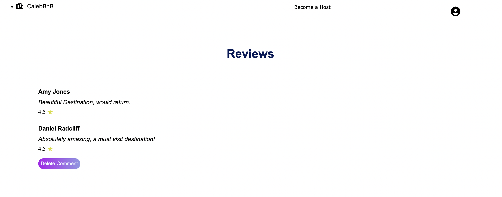

## CalebBnb

Live Render Link: https://calebbnb.onrender.com

CalebBnB is a website clone of AirBnb! Create a page with your home for calebBnB users to examine and potentially book a spot with! Feel free to leave Comments and Ratings for homes you have visited before! CalebBnb supports images for your lovely home, please include images so the world can see your home!

## Technologies used:
- Javascript
- React
- Redux
- Sequelize
- postresSQL
- HTML
- CSS
- Express

This app will have 2 CRUD features for CalebBnb spots and reviews.


This is the home page of CalebBnB that renders automatically upon loading up the app. The homepage queries the database to give you the most up to date housing information on CalebBnb. Select "Become a host" to post your very own home to CalebBnB (must be logged in)!



This is the details page that renders when you select on a home. You can see additional information and navigate to the reviews of this spot in this page. If you are the owner of this spot, you can delete or edit your spot from the spot details page! If you are not the owner the edit and delete options will not render.



This is the Reviews Page to get a look at other CalebBnBs users thoughts on the spot! The stars on the spot are the average of the review stars each commentor is required to give. You can only leave 1 review per spot, then the option to leave a review is replaced with the option to delete the review you have created.



## Road Map for the future
- The ability to edit a comment if you are the owner of the comment.
- <s> The ability to create a Booking with a spot. </s>
- <s> The abilty to delete and edit a Booking you have made. </s>
- The ability to add an image to your review.

## Code I am proud of
```
 const newBook = async (e) => {
        e.preventDefault()
        let err = []
        setErrors([])
        startDate = new Date(startDate).toUTCString();
        endDate = new Date(endDate).toUTCString()

        let userStartSplit = startDate.split(" ")
        let userStartDate = `${userStartSplit[1]}-${userStartSplit[2]}-${userStartSplit[3]}`
        let userEndSplit = endDate.split(" ")
        let userEndDate = `${userEndSplit[1]}-${userEndSplit[2]}-${userEndSplit[3]}`
        let userEndmili = new Date(userEndDate).getTime()
        let userStartmili = new Date(userStartDate).getTime()

        if (userStartmili === userEndmili) err.push('Start date and end date cannot be the same')
        for (let date of bookingsArr) {
            console.log("DATE", date)
            let bookStartDate = new Date(date.startDate).toUTCString()
            let bookEndDate = new Date(date.endDate).toUTCString()
            let splitBookStart = bookStartDate.split(' ')
            let splitBookEnd = bookEndDate.split(' ')
            let dateStringStart = `${splitBookStart[1]}-${splitBookStart[2]}-${splitBookStart[3]}`
            let dateStringEnd = `${splitBookEnd[1]}-${splitBookEnd[2]}-${splitBookEnd[3]}`
            let dateEndmili = new Date(dateStringEnd).getTime()
            let dateStartmili = new Date(dateStringStart).getTime()

            if (userStartmili <= dateEndmili && userStartmili >= dateStartmili) {
                err.push('Start date conflicts with an exisiting booking')
            }
            if (userEndmili <= dateEndmili && userEndmili >= dateStartmili) {
                err.push('End date conflicts with an exisiting booking')
            }
        }

        if (err.length > 0) {
            setErrors(err)
        } else {
            let payload = { startDate, endDate, spotId }
            await dispatch(postNewBooking(payload))
            setSub(true)
            history.push(`/my-profile`)
        }
    }
```
This is my handle submit for creating a new booking. With CalebBnb we throw error validations if a booking overlaps with an existing booking. We make use of the split javascript function to remove the minute and milisecond portion of our timestamps the user provided. We then use the getTime() function to complie a range of miliseconds between the start date and the end date the user submitted. Next, we iterate all bookings previously booked for this specific spot and for each booking we repeat the last steps of getting a range of miliseconds. Now the validators can be written, checking if the user start date or end date interfers with an iterated booking. If so we throw the appropiate error. If no edge cases are met we can confidently go through with the booking of a new spot!

```
router.get('/current', requireAuth, async (req, res, next) => {
    const current = req.user.id;
    const spots = await Spot.findAll({
        where: {
            ownerId: current
        }
    })

    for (let spot of spots) {
        const starts = await Review.findAll({
            where: {
                spotId: spot.id
            },
            attributes: [[Sequelize.fn('AVG', Sequelize.col('stars')), 'avgRating']]
        })
        let avgRating = starts[0].dataValues.avgRating;
        spot.dataValues.avgRating = Number(avgRating).toFixed(1);

        let previewImage = await SpotImage.findOne({
            where: {
                spotId: spot.id
            }
        })
        if (previewImage) {
            spot.dataValues.previewImage = previewImage.dataValues.url;
        }
    }


    return res.json({ spots });
});
```
This backend route selects all spots belonging to a user and includes that spots reviews. Inisde the reviews table we are gathering all the stars that belong to the spot. Wr average the stars and set in to one decimal for the frontend to display!


## How to get Started
- Download the github repo
- cd into the project directory and npm install
- cd into the backend folder and npm start
- while the backend server is running cd into the frontend and npm start
- They run on different ports but a proxy allows this to happen
- Upon npm start in frontend, CalebBnB will run at full functionality!


## contact Information

- github: Cal-flores
